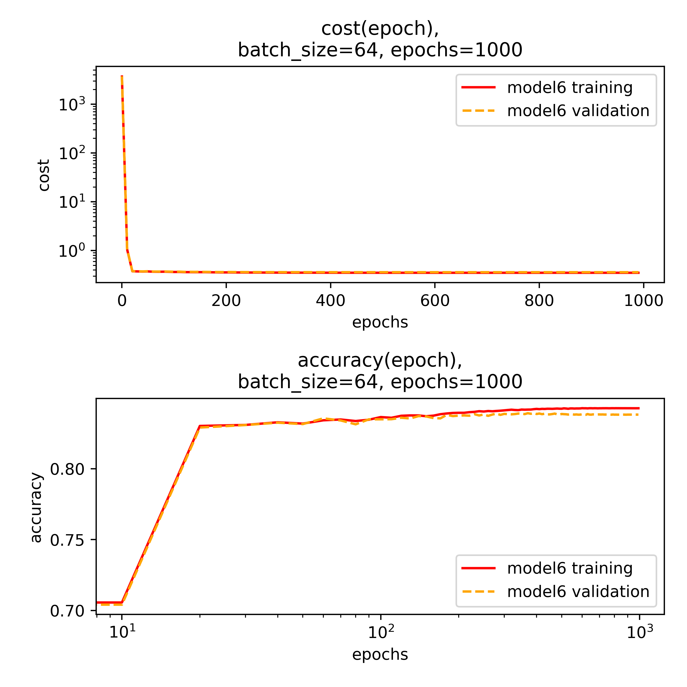

# Kaggle Higgs Challenge
This is my solution to the Kaggle Higgs challenge, for the week 3 assigment of the course "Practical Machine Learning", which I attended at Queen Mary University of London in July 2018

For the report of the data analysis click [here](submission/Aurelio_Amerio_Higgs_report.pdf)